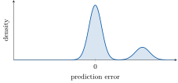

# ONERA 468 CRM, Wall Distribution Regression Challenge: Evaluation

## Evaluation Metrics

Submissions are evaluated using one **primary metric**, the **KL-divergence score**, which
determines the leaderboard ranking. Two **secondary metrics**, **R2** and **wrMAE**, are also
computed and displayed: they help give more context on where the model fails.

Here is a step-by-step overview of how they are computed accompanied with their definitions.

### Step-by-step metric hierarchy

**Step 1: Wall-point-level predictions:**
For each test simulation f, the model predicts the volumetric density at each of the
np = 260,774 surface points, producing a prediction vector $\hat{\rho}$ of size 260,774.

**Step 2: Per-simulation relative error (rMAE):**
For each simulation f, the relative Mean Absolute Error is computed as:

$$
rMAE^f = \frac{\sum_{i=1}^{n_p} |\rho_i^f - \hat{\rho}_i^f|}{\sum_{i=1}^{n_p} |\rho_i^f|}
$$

This measures the mean absolute error (MAE) **relative** to the magnitude of the true density values,
making it scale-independent. It takes values between 0.0 (perfect prediction) and 1.0 (or above
for very poor predictions). **Lower is better.**

**Step 3: Worst-case error across well-converged simulations (wrMAE):**
The wrMAE retains only the **worst-performing simulation** among the well-converged ones
(those with confidence weight wf = 1.0, i.e. |AoA| < 10°).
$$
wrMAE = \max_{f \in \mathcal{W}} rMAE^f
$$

where W is the set of well-converged test simulations.  This error forms an upper bound of the total
mean absotul error of the predictions on well-converged simulations, hence, minimising the worst case rather than the
average ensures that the model performs reliably across all conditions, not just on average.
**Lower is better.**

**Step 4: R2 score (coefficient of determination):**
The **R2 score** measures how well the model captures the variance in the true density values
across all test points and simulations. It is defined as:

$$
R^2 = 1 - \frac{\sum_{f} w_f \sum_{i=1}^{n_p} (\rho_i^f - \hat{\rho}_i^f)^2}{\sum_{f} w_f \sum_{i=1}^{n_p} (\rho_i^f - \bar{\rho})^2}
$$

where:
- $f$ indexes the test simulations, $i$ indexes the surface points (1 to np = 260,774)
- $w_f \in \{0.5, 1.0\}$ is the confidence weight of simulation $f$ (1.0 for well-converged, 0.5 for low-confidence)
- $\bar{\rho} = \frac{\sum_f w_f \sum_i \rho_i^f}{\sum_f w_f \cdot n_p}$ is the weighted mean density across all test points and simulations

A value of R2 = 1.0 means perfect prediction, R2 = 0.0 means the model does no better than
predicting the global mean everywhere. Negative values indicate predictions worse than the global mean.
**Higher is better.**

**Step 5: KL-divergence score (distribution of errors):**

<!-- R2 and wrMAE share a blind spot, they average the error over the whole surface. A model can
score very well on both while still **failing on a small but physically critical
region**, typically the wing or the wing-pylon junction, precisely where the aerodynamic loads
are concentrated. The averaging simply dilutes these localized errors. -->

> **Remember:** As stated in the **Overview** tab (section *Introduction to Aircraft Physics*),
> the second objective of the challenge is to have models that predict well across all regions
> of the aircraft, not only specific ones, hence why we use this metric as the main one.

The KL divergence is an adequate metric to tackle this objective, and it works as follows.
This metric can be seen as a pseudo-distance between two distributions (it lacks symmetry), so
we look at the **shape of the error distribution per simulation**.
For each test simulation f, we compute the prediction error at every surface point,
$e_i^f = \rho_i^f - \hat{\rho}_i^f$, and consider the empirical distribution $P^f$ of these
errors over the 260,774 points:

- A **good** prediction produces errors tightly concentrated around 0 everywhere on the surface:
  a single narrow peak centered at zero.
- A **locally biased** prediction produces more than one peak, or a peak offset from zero,
  because a peak that is not centered at 0 corresponds to an error committed on one
  or more contiguous regions of the aircraft as shown in Figure 1.

<figure style="text-align: center;">

<figcaption>
<em>Figure 1: Example of an error distribution we want to penalize.</em>
</figcaption>
</figure>

We quantify how far $P^f$ is from the ideal case using the **Kullback-Leibler (KL)
divergence** to a reference centered Gaussian
$Q^f = \mathcal{N}(0,\, 0.1\,\sigma_{\rho^f})$, where $\sigma_{\rho^f}$ is the standard
deviation of the true density field of simulation f:

$$
KL^f = D_{KL}(P^f \,\|\, Q^f) = \int_{-\infty}^{+\infty} p(x) \log \frac{p(x)}{q(x)} \, dx
$$

> **Intuition with a compression program:** Assume we have a compression program. We use it to
> compress text A, and from that we get an encoding of each word of text A. We then reuse this
> encoding to compress another text B (assuming the two texts use the same words). The KL
> divergence between text B and text A is the number of **extra** bits we pay on average, per
> word, when we compress text B using the encoding built for text A, instead of an encoding
> built for text B itself.

The KL divergence is computed **per simulation**

**Step 6: Component-weighted KL score:**

Not all regions of the aircraft are equally difficult. Empirically, models struggle most on the
**wing** and the **pylon**, while the fuselage and nacelle are easier. To implement this, the
surface is decomposed into four components and the error distribution of each is evaluated
separately, with weights emphasizing the hard regions:
   - Wing, Pylon: 0.3
   - Fuselage,nacelle : 0.2

The weighted per-simulation divergence $KL_f^w$ is the weighted sum of the per-component
divergences, and the final KL-based score is:

$$
\overline{KL^w} = \frac{1}{N} \sum_{f=1}^{N} KL_f^w
\qquad\qquad
Score_{KL} = \frac{1}{1 + \overline{KL^w}}
$$

where N is the number of test simulations. $Score_{KL}$ lies in (0, 1]: a value close to **1**
means the errors are concentrated around zero across **all** components of the aircraft,
including the physically hard ones. **Higher is better.**

**Step 7: Final leaderboard score:**
TODO...
<!-- Both metrics are combined into a single score out of 10:

`score = 5 × R2 + 5 × (1 − wrMAI)`

| Component | Weight | Direction | Best value | Worst value |
|---|---|---|---|---|
| R2 | 5 | Higher is better | 5.0 (R2=1) | 0.0 (R2=0) |
| 1 − wrMAE | 5 | Higher is better | 5.0 (wrMAE=0) | 0.0 (wrMAE=1) |
| **Total score** | **10** | **Higher is better** | **10.0** | **0.0** |

The two components are given equal weight (5 points each), rewarding models that are both
globally accurate (R2) and reliable in the worst case (wrMAE).

### Small worked example

Suppose the test set contains 3 well-converged simulations (f1, f2, f3), each with
np = 260,774 points:

| Simulation | rMAE |
|---|---|
| f1 | 0.021 |
| f2 | 0.008 |
| f3 | 0.045 |

Then:
- **wrMAE** = max(0.021, 0.008, 0.045) = **0.045**
- Suppose **R2** = 0.987 computed across all points and simulations
- **score** = 5 × 0.987 + 5 × (1 − 0.045) = 4.935 + 4.775 = **9.71 / 10** -->

## Evaluation Procedure

The evaluation follows a standard machine learning competition workflow:

1. **Model initialization:** the model defined in `model.py` is initialized.
2. **Training:** the model receives training data (`X_train`, `Y_train`) and its `fit()` method
   is called.
3. **Prediction:** the model receives test data (`X_test`) without labels and its `predict()`
   method is called to generate predictions, saved as `Yhat.npy`.
4. **Scoring:** predictions are compared against ground truth labels; R2 and wrMAE are computed.
   Execution time is also recorded (training, prediction, and scoring).
5. **Leaderboard ranking:** models are ranked by score (out of 10, higher is better). R2 and
   wrMAE are displayed as additional columns for reference.

## Submitting a Solution

Edit the `model.py` file from the starting kit without changing the file name, and compress it
into a zip file. Submit the zip file in the **My Submissions** tab.

- You can review the logs of each submission to identify errors.
- Execution time is recorded and displayed on the leaderboard.

## Terminology

**R2 (coefficient of determination):** a standard regression metric that measures the proportion
of variance in the true values explained by the model. Ranges from −∞ to 1.0; a perfect model
scores 1.0, a model predicting the global mean everywhere scores 0.0, and negative values
indicate predictions worse than the global mean.

**MAE (Mean Absolute Error):** the average of the absolute differences between predictions and
true values. Straightforward to interpret: it is in the same units as the target variable.

**rMAE (relative MAE):** the MAE normalized by the sum of absolute true values for a given
simulation. This makes the metric scale-independent, allowing fair comparison across simulations
with different density magnitudes.

**wrMAE (worst-case relative MAE):** the maximum rMAE across all well-converged test simulations.
It penalizes models that perform well on average but fail on specific hard conditions.
